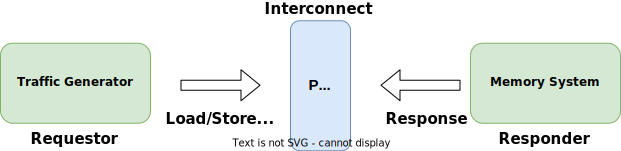

<!-- _class: title -->

## Using synthetic traffic generators

Using synthetic traffic generators to test memory systems.

---

<!-- _class: center-image -->

## Synthetic Traffic Generation

Synthetic traffic generation is a technique for driving memory subsystems without requiring the simulation of processor models and running workload programs. We have to note the following about synthetic traffic generation.

- It can be used for the following: measuring maximum theoretical bandwidth, testing correctness of cache coherency protocol
- It can not be used for: measuring the execution time of workloads

Synthetic traffic could follow a certain pattern like *sequential (linear)*, *strided*, and *random*. In this section we will look at tools in gem5 that facilitate synthetic traffic generation.



---

## gem5: stdlib Components for Synthetic Traffic Generation

gem5's standard library has a collection of components for generating synthetic traffic. All such components inherit from `AbstractGenerator`, found in `src/python/gem5/components/processors`.

- These components simulate memory accesses. They are intended to replace a processor in a system that you configure with gem5.
- Examples of these components include `LinearGenerator` and `RandomGenerator`.

We will see how to use `LinearGenerator` and `RandomGenerator` to stimulate a memory subsystem.

In the next slides we will look at `LinearGenerator` and `RandomGenerator` at a high level. We'll see how to write a configuration script that uses them.

---

<!-- _class: two-col code-70-percent -->

## Types of traffic generators

### LinearGenerator

[Python Here](/gem5/src/python/gem5/components/processors/linear_generator.py)

```python
class LinearGenerator(AbstractGenerator):
    def __init__(
        self,
        num_cores: int = 1,
        duration: str = "1ms",
        rate: str = "100GB/s",
        block_size: int = 64,
        min_addr: int = 0,
        max_addr: int = 32768,
        rd_perc: int = 100,
        data_limit: int = 0,
    ) -> None:
```

### RandomGenerator

[Python Here](/gem5/src/python/gem5/components/processors/random_generator.py)

```python
class RandomGenerator(AbstractGenerator):
    def __init__(
        self,
        num_cores: int = 1,
        duration: str = "1ms",
        rate: str = "100GB/s",
        block_size: int = 64,
        min_addr: int = 0,
        max_addr: int = 32768,
        rd_perc: int = 100,
        data_limit: int = 0,
    ) -> None:
```

---
<!-- _class: two-col -->

## LinearGenerator/RandomGenerator: Knobs

- **num_cores**
  - The number of cores in your system
- **duration**
  - Length of time to generate traffic
- **rate**
  - Rate at which to request data from memory
    - **Note**: This is *NOT* the rate at which memory will respond. This is the **maximum** rate at which requests will be made
- **block_size**
  - The number of bytes accessed with each read/write
- **min_addr**
  - The lowest memory address for the generator to access (via reads/writes)
- **max_addr**
  - The highest memory address for the generator to access (via reads/writes)
- **rd_perc**
  - The percentage of accesses that should be reads
- **data_limit**
  - The maximum number of bytes that the generator can access (via reads/writes)
    - **Note**: if `data_limit` is set to 0, there will be no data limit.

---
<!-- _class: two-col -->

## Traffic Patterns Visualized

`min_addr`: 0, `max_addr`: 4, `block_size`: 1

**Linear**: We want to access addresses 0 through 4 so a linear access would mean accessing memory in the following order.

**Random**: We want to access addresses 0 through 4 so a random access would mean accessing memory in any order. (In this example, we are showing the order: 1, 3, 2, 0).


---

<!-- _class: exercise -->

## Exercise: Measuring memory performance

In this exercise you will use different traffic patterns to better understand the performance characteristics of gem5's memory models.
Use a 32 GiB/s `SimpleMemory` with latency of 20ns. Linear and random traffic with a rate of 16, 32, and 64 GiB/s, and 100% and 50% read percentages. (You may not need to run everything.)

### Questions

- When using the SimpleMemory model, how does the memory bandwidth change with different read-write ratios? Why or why not?
- When using DDR4 memory, how does the memory bandwidth change with different traffic read-write ratios? Why or why not?
- Compare the performance of DDR4 to LPDDR5. Which has better bandwidth? What about latency? (Or, is this the wrong way to measure latency?)
- Run with a single channel of DDR4 and compare that to the performance of 4 channels of LPDDR5. What is the bandwidth difference?

---

## Step 1: Create a test board for SimpleMemory

Starting from the skeleton code provided in `/workspaces/latin-america-2024/materials/02-Using-gem5/03-traffic-generators/memory-test.py`, write code to create memory traces using the linear generator.

Use the `TestBoard` instead of the `SimpleBoard` for this experiment.
See [`TestBoard`](/gem5/src/python/gem5/components/boards/test_board.py) for hints.

Use the `SingleChannelSimpleMemory` for the memory system.
Set the latency to be 20ns, the bandwidth to be 32GiB/s, the latency variance to be 0s (zero seconds), and the size to be 1GiB.

Use `NoCache` for the cache hierarchy.

Use a `LinearGenerator` with a rate of 16GiB/s as the "processor" (which is called `generator` in this case).

---

<!-- _class: two-col -->

## Step 1: Answer

```python
board = TestBoard(
    clk_freq="3GHz", # ignored
    generator=LinearGenerator(num_cores=1, rate="16GiB/s"),
    memory=SingleChannelSimpleMemory(
        latency="20ns", bandwidth="32GiB/s",
        latency_var="0s", size="1GiB"),
    cache_hierarchy=NoCache(),
)

simulator = Simulator(board=board)
simulator.run()
```

The generator and the memory have their own clock domains to the `clk_freq` parameter is ignored.

For the memory system, we are using a `SingleChannelSimpleMemory` with a latency of 20ns and a bandwidth of 32GiB/s. We set the latency variance to 0s and the size to 1 GiB (just needs to be bigger than the generator will generate).

The `LinearGenerator` is generating traffic at 16GiB/s and the `SimpleMemory` has a bandwidth of 32GiB/s.

We are using a `NoCache` cache hierarchy to simplify the experiment. With `NoCache`, the memory system is directly connected to the processor.

---

## Step 2: Run the experiment

Run your script in gem5!

Look at the results in the stats file.

---

## Step 2: Answer

```sh
cd exercises/02-Using-gem5/03-traffic-generators/
gem5 memory-test.py
```

Look in `m5out/stats.txt` for the results. Remember that this directory and file is created in whichever directory you run the gem5 binary.

`board.processor.cores.generator.readBW` is 17180800000 (or 17.1808 GB/s).

Note that the bandwidth is given in GB (*not* GiB). I.e., 1 GB = 10^9 bytes.

---

## Step 3a: Add An Argument Parser

For this step, you can add arguments to your script with the `argparse` Python library. In this experiment you will add an argument to set the rate of the generator. This way, you don't have to keep modifying your script.

```python
parser = argparse.ArgumentParser()
parser.add_argument("rate", type=str, help="The rate of the generator")
args = parser.parse_args()
```

Create also an argument to set the read percentage for the traffic generator.

Adjust the rate argument inside the generator definition to use the argument value (i.e. `args.rate`).

Also add the read percentage parameter (i.e `rd_perc`) in the generator definition and set it to the argument corresponding to this variable.

---

## Step 3b: Add simstats

You want to use `simstats` to get the bandwidth in the script directly instead of reading `stats.txt`.

```python
stats = simulator.get_simstats()
seconds = stats.simTicks.value / stats.simFreq.value
total_bytes = (
    stats.board.processor.cores[0].generator.bytesRead.value
    + stats.board.processor.cores[0].generator.bytesWritten.value
)
latency = (
    stats.board.processor.cores[0].generator.totalReadLatency.value
    / stats.board.processor.cores[0].generator.totalReads.value
)
print(f"Total bandwidth: {total_bytes / seconds / 2**30:0.2f} GiB/s")
print(f"Average latency: {latency / stats.simFreq.value * 1e9:0.2f} ns")
```

---

## Step 3c: Run your script

Run your script in gem5 using  six configurations:

1. 16 GiB/s and 50% reads,
2. 16 GiB/s and 100% reads,
3. 32 GiB/s and 50% reads,
4. 32 GiB/s and 100% reads,
5. 64 GiB/s and 50% reads,
6. and 64 GiB/s and 100% reads.

Look at the output in the terminal.

---

## Step 3 a, b, c: Answers

Run the script using `gem5 memory-test.py 16GiB/s 50` for each of the 6 configurations.
Results for running with 16 GiB/s, 32 GiB/s, 64 GiB/s, and 100% reads and 50% reads.

| Bandwidth | Read Percentage | Avg Latency (ns) | Bandwidth (GiB/s) |
|-----------:|:-----------------:|:---------------------:|:---------------------:|
| 16 GiB/s  | 100%            | 23.81               | 16.00               |
|           | 50%             | 23.81               | 16.00               |
| 32 GiB/s  | 100%            | 23.81               | 31.99               |
|           | 50%             | 23.80               | 31.99               |
| 64 GiB/s  | 100%            | 25.66               | 32.11               |
|           | 50%             | 25.67               | 32.11               |

With the `SimpleMemory` you don't see any complex behavior in the memory model (but it **is** fast).

---

## Running Channeled Memory

- Open [`gem5/src/python/gem5/components/memory/single_channel.py`](../../gem5/src/python/gem5/components/memory/single_channel.py)
- We see `SingleChannel` memories such as:

```python
def SingleChannelDDR4_2400(
    size: Optional[str] = None,
) -> AbstractMemorySystem:
    """
    A single channel memory system using DDR4_2400_8x8 based DIMM.
    """
    return ChanneledMemory(DDR4_2400_8x8, 1, 64, size=size)
```

- We see the `DRAMInterface=DDR4_2400_8x8`, the number of channels=1, interleaving_size=64, and the size.

---

## Step 4: Using DDR4 memory

Use the `SingleChannelDDR4_2400` memory system with the `LinearGenerator` and `RandomGenerator` to see how the memory bandwidth changes with different traffic read-write ratios.

You may want to add another argument to the `argparse` to specify the memory system and the type of generator (linear or random).

Note: You may not need to run all possibly combinations. Try to run the minimum to answer the questions.

---

## Step 4: Answer

Results for running with DDR4 with 16 GiB/s, 32 GiB/s, and 100% reads and 50% reads.

| Bandwidth | Read Perc | Linear | Random|
|-----------:|:-----------------:|:--------------:|:--------------:|
| | | *Speed (GiB/s)/Avg Lat (ns)* | * Speed (GiB/s) /Avg Lat (ns)* |
| 16 GiB/s  | 100%            | 12.92 / 320.61    | 15.58  / 115.89 |
|           | 50%             | 12.05 / 341.84    | 15.93 / 126.84  |
| 64 GiB/s  | 100%            | 12.92 / 323.51    | 16.99 / 251.70  |
|           | 50%             | 12.19 / 379.48    | 18.49 / 259.00  |

As expected, because of read-to-write turn around, reading 100% is more efficient than 50% reads.
Also as expected, the bandwidth is lower than the SimpleMemory (only about 75% utilization).

Somewhat surprising, the memory modeled has enough banks to handle random traffic efficiently.

---

## Step 5: Run with LPDDR5

Note that we don't have a `SingleChannelLPDDR5` memory system in the standard library. We will have to add it.

Import the *interface* from the `dram_interfaces` package and create a `SingleChannelLPDDR5` memory system.

You can use the `ChanneledMemory` class to create this new memory system.

See [`ChanneledMemory`](/gem5/src/python/gem5/components/memory/memory.py) for hints.

---

## Step 5: Answer

```python
def get_memory(mem_type: str):
    if mem_type == "simple":
        return SingleChannelSimpleMemory(
            latency="20ns", bandwidth="32GiB/s", latency_var="0s", size="1GiB"
        )
    elif mem_type == "DDR4":
        return SingleChannelDDR4_2400()
    elif mem_type == "SC_LPDDR5":
        return ChanneledMemory(LPDDR5_6400_1x16_BG_BL32, 1, 64)
```

The last line will create a new memory system with LPDDR5 using a single channel.

---

## Step 5: Answer Cont.

| Bandwidth | Read Perc | Linear Speed (GiB/s)/Latency)(ns) | Random Speed (GiB/s)/Latency(ns) |
|-----------:|:-----------------:|:-----------:|:---------------:|
| 16 GiB/s  | 100%            | 11.10 / 371.97 | 11.15 / 370.20 |
|           | 50%             | 8.76 / 449.05  | 10.42 / 393.84 |
| 64 GiB/s  | 100%            | 11.10 / 372.62 | 11.16 / 370.88 |
|           | 50%             | 8.80 / 474.75  | 10.46 / 410.66 |

So, LPDDR5 doesn't perform quite as well as DDR4.
Not only is the bandwidth lower, but the latency is higher.

---

## Step 6: Run with multiple channels

Now, let's run with multiple channels of LPDDR5.
You can use the same `ChanneledMemory` interface to create a memory system with 4 channels.

---

## Step 6: Answer

| Bandwidth | Read Perc | Linear Speed (GiB/s)/Latency)(ns) | Random Speed (GiB/s)/Latency(ns) |
|-----------:|:-----------------:|:-----------:|:---------------:|
| 16 GiB/s  | 100%            | 16.00 / 159.00  | 16.00 / 138.78  |
|           | 50%             | 16.00 / 160.51  | 16.00 / 100.49  |
| 32 GiB/s  | 100%            | 31.99 / 199.47      | 31.98 / 154.19  |
|           | 50%             | 30.28 / 168.88               | 31.98 / 120.04  |
| 64 GiB/s  | 100%            | 44.31        278.32        | 43.75 / 265.33  |
|           | 50%             | 38.23   /185.18             | 56.60 / 126.56  |

---

## Exercise Questions

- When using the SimpleMemory model, how does the memory bandwidth change with different read-write ratios? Why or why not?
- When using DDR4 memory, how does the memory bandwidth change with different traffic read-write ratios? Why or why not?
- Compare the performance of DDR4 to LPDDR5. Which has better bandwidth? What about latency? (Or, is this the wrong way to measure latency?)
- Run with a single channel of DDR4 and compare that to the performance of 4 channels of LPDDR5. What is the bandwidth difference?

Use <https://app.sli.do/event/qpr43XWrbjYJCdE3GHGCWg> to answer the questions.

---

<!-- _class: start -->

## Extra exercise

Creating a new generator.

---

## Extending AbstractGenerator

gem5 has a lot of tools in its standard library, but if you want to simulate specific memory accesses patterns in your research, there might not be anything in the standard library to do this.

In this case, you would have to extend `AbstractGenerator` to create a concrete generator that is tailored to your needs.

To do this, we will go through an example called `HybridGenerator`.

The goal of `HybridGenerator` is to simultaneously simulate both linear and random memory accesses.

To do this, we need `LinearGeneratorCores` (to simulate linear traffic) and `RandomGeneratorCores` (to simulate random traffic).

---

## 06-traffic-gen: HybridGenerator: A Quick Side Note about LinearGeneratorCores

`LinearGeneratorCores` simulate linear traffic.

When we have multiple `LinearGeneratorCores`, if we configure each one to have the same `min_addr` and `max_addr`, each one will start simulating memory accesses at the same `min_addr` and go up to the same `max_addr`. They will be accessing the same addresses at the same time.

We want `LinearGeneratorCore` to simulate a more reasonable accesses pattern.

Therefore, we will have each `LinearGeneratorCore` simulate accesses to a different chunk of memory. To do this, we will have to split up memory into equal-sized chunks and configure each `LinearGeneratorCore` to simulate accesses to one of these chunks.

---
<!-- _class: center-image -->

## 06-traffic-gen: HybridGenerator: A Quick Side Note about LinearGeneratorCores Cont.

Here's a diagram that shows how each `LinearGeneratorCore` should access memory.


---

## 06-traffic-gen: HybridGenerator: Dividing Memory Address Range

When we create a `HybridGenerator`, we have to determine which `LinearGeneratorCore` gets what chunk of memory.

As previously discussed, we need to partition the memory address range into equally sized sections and configure each `LinearGeneratorCore` to simulate accesses to a different section.

To partition, we will use the `partition_range()` function in [`gem5/src/python/gem5/components/processors/abstract_generator.py`](/gem5/src/python/gem5/components/processors/abstract_generator.py).

This function takes the range of `min_addr` to `max_addr` and partitions it into `num_partitions` equal-length pieces.

For example, if `min_addr` = 0, `max_addr` = 9, and `num_partitions` = 3, then `partition_range` would return <0,3>, <3,6>, <6,9>.

---

## 06-traffic-gen: HybridGenerator: A quick reminder about RandomGeneratorCores

We also have to consider the `RandomGeneratorCores`.

It would be reasonable to assume that we should partition them like the `LinearGeneratorCores`, but this is not the case.

Even if each `RandomGeneratorCore` has the same `min_addr` and `max_addr`, since each one simulates a random memory access, each one will be simulating accesses to different (random) memory addresses.

---

<!-- _class: center-image -->

## 06-traffic-gen: HybridGenerator: Dividing Memory Address Range Cont.

In the end, this is how each core will simulate memory accesses.


---

<!-- _class: code-70-percent -->

## 06-traffic-gen: HybridGenerator: Choosing a Distribution of Cores

Now that we know how each core will access memory, next, we need to determine how many `LinearGeneratorCores` and `RandomGeneratorCores` we need.

There are many correct ways to do this, but we will use the following function to determine the number of `LinearGeneratorCores`.

```python
        def get_num_linear_cores(num_cores: int):
            """
            Returns the largest power of two that is smaller than num_cores
            """
            if (num_cores & (num_cores - 1) == 0):
                return num_cores//2
            else:
                return 2 ** int(log(num_cores, 2))
```

The rest of the cores will be `RandomGeneratorCores`.

---

<!-- _class: two-col code-60-percent -->

## 06-traffic-gen: HybridGenerator Constructor

Let's start looking at the code!

Make sure you have the following file open.
[`materials/02-Using-gem5/03-running-in-gem5/06-traffic-gen/components/hybrid_generator.py`](../../materials/02-Using-gem5/03-running-in-gem5/06-traffic-gen/components/hybrid_generator.py)

On the right, you'll see the constructor for `HybridGenerator`.

When we initialize `HybridGenerator` (via `def __init__`), we will be initializing an `AbstractGenerator` (via `super() __init__`) with the values on the right.

```python
class HybridGenerator(AbstractGenerator):
    def __init__(
        self,
        num_cores: int = 2,
        duration: str = "1ms",
        rate: str = "1GB/s",
        block_size: int = 8,
        min_addr: int = 0,
        max_addr: int = 131072,
        rd_perc: int = 100,
        data_limit: int = 0,
    ) -> None:
        if num_cores < 2:
            raise ValueError("num_cores should be >= 2!")
        super().__init__(
            cores=self._create_cores(
                num_cores=num_cores,
                duration=duration,
                rate=rate,
                block_size=block_size,
                min_addr=min_addr,
                max_addr=max_addr,
                rd_perc=rd_perc,
                data_limit=data_limit,
            )
        )
```

---

## 06-traffic-gen: Designing a HybridGenerator

Right now, our `HybridGenerator` class has a constructor, but we need to return a list of cores.

In gem5, the method that returns a list of cores is conventionally named `_create_cores`.

If you look at our file, [`hybrid_generator.py`](../../materials/02-Using-gem5/03-running-in-gem5/06-traffic-gen/components/hybrid_generator.py), you'll see this method called `_create_cores`.

---

## 06-traffic-gen: HybridGenerator: Initializing Variables

Let's define `_create_cores`!

Let's start by declaring/defining some important variables.

First, we'll declare our list of cores.

Then, we'll define the number of `LinearGeneratorCores` and `RandomGeneratorCores`.

Add the following lines under the comment labeled `(1)`.

```python
core_list = []

num_linear_cores = get_num_linear_cores(num_cores)
num_random_cores = num_cores - num_linear_cores
```

---

## 06-traffic-gen: HybridGenerator: Partitioning Memory Address Range

Next, let's define the memory address range for each `LinearGeneratorCore`.

If we want to give each `LinearGeneratorCore` an equal chunk of the given memory address range, we need to partition the range of `min_addr` to `max_addr` into `num_linear_cores` pieces.

To do this, we need to add the following line to our code under the comment labeled `(2)`.

```python
addr_ranges = partition_range(min_addr, max_addr, num_linear_cores)
```

`addr_ranges` will be a `num_linear_cores`-long list of equal-length partitions from `min_addr` to `max_addr`.

---

## 06-traffic-gen: Partitioning Memory Address Range Cont.

For example, we have `min_addr=0`, `max_addr=32768`, and `num_cores=16` (8 `LinearGeneratorCores`), then

```sh
addr_ranges=
  [(0, 4096), (4096, 8192), (8192, 12288), (12288, 16384),
  (16384, 20480), (20480, 24576), (24576, 28672), (28672, 32768)]
```

For the `i`'th `LinearGeneratorCore`, we take the `i`'th entry in `addr_ranges`. `min_addr` is the first value that entry, and `max_addr` is the second value in that entry.

In this example, `LinearGeneratorCore` 0 gets initialized with `min_addr=0` and `max_addr=4096`, `LinearGeneratorCore` 1 gets initialized with `min_addr=4096` and `max_addr=8192`, etc.

---
<!-- _class: two-col -->

## 06-traffic-gen: HybridGenerator: Creating a List of Cores: LinearGeneratorCore

Next, let's start creating our list of cores.

First, let's add all the `LinearGeneratorCores`.

Add the lines on the right under the comment labeled `(3)`.

```python
for i in range(num_linear_cores):
            core_list.append(LinearGeneratorCore(
                duration=duration,
                rate=rate,
                block_size=block_size,
                min_addr=addr_ranges[i][0],
                max_addr=addr_ranges[i][1],
                rd_perc=rd_perc,
                data_limit=data_limit,)
            )
```

---
<!-- _class: two-col -->

## 06-traffic-gen: HybridGenerator: Creating a List of Cores Explained: LinearGeneratorCore

In the for loop, we create `num_linear_cores` `LinearGeneratorCores` and append each one to our `core_list`.

Each `LinearGeneratorCore` parameter is initialized with the same values from the constructor, except for `min_addr` and `max_addr`.

We change `min_addr` and `max_addr` so that each `LinearGeneratorCore` only simulates accesses to a section of the range of `HybridGenerator's` `min_addr` to `max_addr`.

###

```python
for i in range(num_linear_cores):
            core_list.append(LinearGeneratorCore(
                duration=duration,
                rate=rate,
                block_size=block_size,
                min_addr=addr_ranges[i][0],
                max_addr=addr_ranges[i][1],
                rd_perc=rd_perc,
                data_limit=data_limit,)
            )
```

---
<!-- _class: two-col -->

## 06-traffic-gen: HybridGenerator: Creating a List of Cores: RandomGeneratorCore

Now that we've added the `LinearGeneratorCores`, let's add all the `RandomGeneratorCores`.

Add the lines on the right under the comment labeled `(4)`.

###

```python
for i in range(num_random_cores):
            core_list.append(RandomGeneratorCore(
                duration=duration,
                rate=rate,
                block_size=block_size,
                min_addr=min_addr,
                max_addr=max_addr,
                rd_perc=rd_perc,
                data_limit=data_limit,)
            )
```

---
<!-- _class: two-col -->

## 06-traffic-gen: HybridGenerator: Creating a List of Cores Explained: RandomGeneratorCore

Once again, in the for loop, we create `num_linear_cores` `RandomGeneratorCores` and append each one to our core_list.

Each `RandomGeneratorCore` parameter is initialized with the same values from the constructor, including `min_addr` and `max_addr`.

`min_addr` and `max_addr` do not change because each `RandomGeneratorCore` should be able to access the entire range of `HybridGenerator's` `min_addr` to `max_addr`.

###

```python
for i in range(num_random_cores):
            core_list.append(RandomGeneratorCore(
                duration=duration,
                rate=rate,
                block_size=block_size,
                min_addr=min_addr,
                max_addr=max_addr,
                rd_perc=rd_perc,
                data_limit=data_limit,)
            )
```

---

## 06-traffic-gen: HybridGenerator: Returning and Beginning Configuration

We're almost done with this file!

Let's return our `core_list` by adding the following line under the comment labeled `(5)`.

```python
return core_list
```

Now, open the file [materials/02-Using-gem5/03-running-in-gem5/06-traffic-gen/simple-traffic-generators.py](../../materials/02-Using-gem5/03-running-in-gem5/06-traffic-gen/simple-traffic-generators.py).

Let's replace our `LinearGenerator` with a `HybridGenerator`.

First, add the following line somewhere at the top of your code to import the `HybridGenerator`.

```python
from components.hybrid_generator import HybridGenerator
```

---

<!-- _class: two-col code-70-percent -->

## 06-traffic-gen: HybridGenerator: Configuring

In this section of code to the right, you should currently have a `LinearGenerator`.

Let's replace it with a `HybridGenerator`.

Replace the following lines

```python
generator = LinearGenerator(
    num_cores=1
)
```

with

```python
generator = HybridGenerator(
    num_cores=6
)
```

###

```python
cache_hierarchy = MyPrivateL1SharedL2CacheHierarchy()

memory = SingleChannelDDR3_1600()

generator = LinearGenerator(
    num_cores=1
)

motherboard = TestBoard(
    clk_freq="3GHz",
    generator=generator,
    memory=memory,
    cache_hierarchy=cache_hierarchy,
)
```

---
<!-- _class: two-col code-70-percent -->

## 06-traffic-gen: HybridGenerator: Configuring Cont.

This is what it should look like now.

###

```python
cache_hierarchy = MyPrivateL1SharedL2CacheHierarchy()

memory = SingleChannelDDR3_1600()

generator = HybridGenerator(
    num_cores=6
)

motherboard = TestBoard(
    clk_freq="3GHz",
    generator=generator,
    memory=memory,
    cache_hierarchy=cache_hierarchy,
)
```

---

## 06-traffic-gen: HybridGenerator: Running

Now, that we've created a `HybridGenerator`, let's run the program again!

Make sure you're in the following directory.

**`materials/02-Using-gem5/03-running-in-gem5/06-traffic-gen/`**

Now run with the following command.

```sh
gem5 --debug-flags=TrafficGen --debug-end=1000000 \
simple-traffic-generators.py
```

---

## 06-traffic-gen: HybridGenerator: Output

After running the command, you should see something like below.

```sh
   7451: system.processor.cores5.generator: RandomGen::getNextPacket: r to addr 80a8, size 8
   7451: system.processor.cores5.generator: Next event scheduled at 14902
   7451: system.processor.cores4.generator: RandomGen::getNextPacket: r to addr 10a90, size 8
   7451: system.processor.cores4.generator: Next event scheduled at 14902
   7451: system.processor.cores3.generator: LinearGen::getNextPacket: r to addr 18000, size 8
   7451: system.processor.cores3.generator: Next event scheduled at 14902
   7451: system.processor.cores2.generator: LinearGen::getNextPacket: r to addr 10000, size 8
   7451: system.processor.cores2.generator: Next event scheduled at 14902
   7451: system.processor.cores1.generator: LinearGen::getNextPacket: r to addr 8000, size 8
   7451: system.processor.cores1.generator: Next event scheduled at 14902
   7451: system.processor.cores0.generator: LinearGen::getNextPacket: r to addr 0, size 8
   7451: system.processor.cores0.generator: Next event scheduled at 14902
```

As you can see, cores 0, 1, 2, and 3 are `LinearGeneratorCores`, and cores 4 and 5 are `RandomGeneratorCores`!

---

## 06-traffic-gen: HybridGenerator: Statistics

Now, let's look at some of the statistical differences between our `LinearGeneratorCores` and `RandomGeneratorCores`.

Run the following command to see the miss rate for each core's L1 data cache.

```sh
grep ReadReq.missRate::processor m5out/stats.txt
```

On the next slide, you'll see the expected output (with some text removed for readability).

---

## 06-traffic-gen: HybridGenerator: Statistics Cont.

```sh
system.cache_hierarchy.l1dcaches0.ReadReq.missRate::processor.cores0.generator     0.132345
system.cache_hierarchy.l1dcaches1.ReadReq.missRate::processor.cores1.generator     0.133418
system.cache_hierarchy.l1dcaches2.ReadReq.missRate::processor.cores2.generator     0.133641
system.cache_hierarchy.l1dcaches3.ReadReq.missRate::processor.cores3.generator     0.132971
system.cache_hierarchy.l1dcaches4.ReadReq.missRate::processor.cores4.generator     0.876426
system.cache_hierarchy.l1dcaches5.ReadReq.missRate::processor.cores5.generator     0.875055
```

Cores 0, 1, 2, and 3 (`LinearGeneratorCores`) have a miss rate of **0.13309375** (~13.3%) on average.

Cores 4 and 5 (`RandomGeneratorCores`) have a miss rate of **0.8757405** (~87.5%) on average.

This is because `LinearGeneratorCores` access memory linearly. Therefore, they exhibit more locality which in turn results in less misses in the l1dcache.

On the other hand, since the `RandomGeneratorCores` access memory randomly, the caches can't take advantage of locality in the same way.

---
<!-- Speaker Notes:

## More summaries

m5ops can be used to communicate between simulated workload and the simulator

Traffic generator can abstract away the details of a data requestor such as CPU for generating test cases for memory systems

-->

## Summary

Overall, we discussed two different types of traffic generators: **Linear** and **Random**.

`LinearGenerators` simulate linear memory accesses, and `RandomGenerators` simulate random memory accesses.

We looked into how to configure a board that uses these traffic generators.

We also extended the `AbstractGenerator` class to create a `HybridGenerator`, which simulates linear and random memory accesses simultaneously.

Finally, we saw some of the statistical differences between`LinearGeneratorCores` and `RandomGeneratorCores`.
